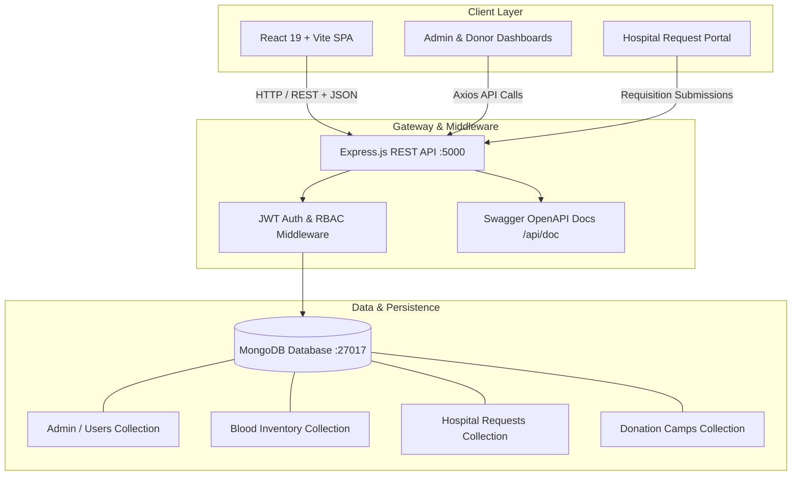

<div align="center">

# 🩸 Blood Bank Management System (BBMS)

[](https://github.com/)
[](LICENSE)
[](https://react.dev/)
[](https://expressjs.com/)
[](https://www.mongodb.com/)
[](https://tailwindcss.com/)
[](http://localhost:5000/api/doc/)

**A modern, full-stack, enterprise-grade digital healthcare platform designed to streamline blood donation workflows, real-time inventory tracking, and emergency hospital coordination.**

Developed & Maintained by **[Nitesh Singh](https://github.com/)**

[Explore Features](#-key-features) • [Tech Stack](#-technology-stack) • [Quick Start](#-getting-started) • [API Documentation](#-api-documentation) • [UI Showcase](#-ui-showcase)

---

</div>

## 📌 Executive Summary

Many blood banks and healthcare centers continue to depend on fragmented paper logs, manual data entry, and uncoordinated communication channels. This creates critical operational bottlenecks:
- **No real-time visibility** into live blood stock across blood types and components.
- **Critical delays** during acute emergency blood requests and transfusions.
- **High vulnerability** to human record-keeping errors and donor tracking omissions.
- **Decentralized coordination** between blood donor camps, hospitals, testing laboratories, and blood banks.

The **Blood Bank Management System (BBMS)** solves this by delivering an end-to-end digital infrastructure that unifies donors, healthcare facilities, diagnostic labs, and administrative personnel into a synchronized, secure platform.

---

## 👨‍💻 Project Lead & Maintainer

<table align="center">
  <tr>
    <td align="center">
      <h3><b>Nitesh Singh</b></h3>
      <p><i>Full-Stack Software Engineer & Solutions Architect</i></p>
      <p>
        <a href="https://github.com/"></a>
        <a href="https://linkedin.com/"></a>
      </p>
    </td>
  </tr>
</table>

---

## ✨ Key Features

### 🛡️ Role-Based Access Control (RBAC)
- **Admin Dashboard:** Holistic administrative control over all system assets, inventory levels, donation approvals, and user accounts.
- **Donor Portal:** Seamless donor profile registration, appointment scheduling, donation history tracking, and eligibility validation.
- **Hospital & Facility Management:** Automated blood requisition creation, urgency prioritization (Emergency vs. Routine), and status tracking.
- **Blood Lab Operations:** Quality assurance, blood sample screening, processing, and component categorization.

### 📦 Real-Time Inventory & Stock Intelligence
- Accurate real-time stock balances across all blood groups (`A+`, `A-`, `B+`, `B-`, `AB+`, `AB-`, `O+`, `O-`).
- Automatic inventory depletion and replenishment triggers based on verified donations and completed requests.
- Low-stock threshold alerts to prevent critical supply deficits.

### 🏕️ Blood Donation Drives & Camp Coordination
- Schedule, publish, and manage public blood donation camps.
- Track registered attendees and collect donor statistics per event.

### 🔒 Enterprise Security & Reliability
- JSON Web Token (JWT) stateless session authentication.
- Password hashing utilizing industry-standard `bcryptjs`.
- Strict CORS configuration and payload validation middleware.
- Full interactive REST API documentation powered by Swagger / OpenAPI.

---

## 🛠️ Technology Stack

| Layer | Technology | Purpose |
| :--- | :--- | :--- |
| **Frontend Framework** | [React 19](https://react.dev/) | High-performance component-based client interface |
| **Build Tool** | [Vite 7](https://vite.dev/) | Next-generation frontend tooling and instant HMR |
| **Styling & UI** | [Tailwind CSS v4](https://tailwindcss.com/) + [tw-animate-css](https://www.npmjs.com/package/tw-animate-css) | Modern utility-first responsive styling and animations |
| **Icons & Motion** | [Lucide React](https://lucide.dev/) + [Framer Motion](https://www.framer.com/motion/) | Polished micro-interactions and vector iconography |
| **Routing** | [React Router v7](https://reactrouter.com/) | Declarative client-side route handling |
| **HTTP Client** | [Axios](https://axios-http.com/) | Promise-based HTTP client with interceptors |
| **Notifications** | [React Hot Toast](https://react-hot-toast.com/) / [React Toastify](https://fkhadra.github.io/react-toastify/) | Dynamic toast alerts and feedback |
| **Backend Runtime** | [Node.js](https://nodejs.org/) (ES Modules) | High-throughput asynchronous JavaScript runtime |
| **Web Framework** | [Express.js v5](https://expressjs.com/) | RESTful routing and API middleware architecture |
| **Database** | [MongoDB](https://www.mongodb.com/) via [Mongoose ODM](https://mongoosejs.com/) | Scalable NoSQL document schema and data persistence |
| **Authentication** | [JWT](https://jwt.io/) + [bcryptjs](https://www.npmjs.com/package/bcryptjs) | Cryptographic security and role validation |
| **API Docs** | [Swagger UI Express](https://swagger.io/) | Interactive API specification and live testing suite |
| **Containerization** | [Docker](https://www.docker.com/) & Docker Compose | Multi-container orchestration and deployment |

---

## 📐 System Architecture



---

## 📂 Repository Structure

```text
blood-bank-management-system/
├── backend/                        # Express.js REST API & Database Services
│   ├── config/                     # Database and system configuration
│   ├── controllers/                # Business logic handlers
│   ├── middleware/                 # Auth verification, RBAC, and error handlers
│   ├── models/                     # Mongoose document schemas
│   ├── openapi/                    # Swagger API documentation definitions
│   ├── routes/                     # Express route endpoints
│   ├── seedAdmin.js                # Initial admin account bootstrap script
│   ├── server.js                   # Application entry point
│   ├── .env.example                # Backend environment variable template
│   └── package.json
│
├── frontend/                       # React + Vite Frontend Application
│   ├── public/                     # Static media and assets
│   ├── src/
│   │   ├── assets/                 # Graphics and branding
│   │   ├── components/             # Reusable UI components & layouts
│   │   ├── context/                # React state providers
│   │   ├── pages/                  # Route views (Auth, Admin, Donor, Hospital)
│   │   ├── utils/                  # API clients and formatting helpers
│   │   ├── App.jsx                 # Application root & routing
│   │   └── main.jsx                # DOM mount entry
│   ├── .env.example                # Frontend environment variable template
│   ├── vite.config.js              # Vite bundler & reverse-proxy config
│   └── package.json
│
├── docker-compose.yml              # Container orchestration for full stack
├── README.md                       # Documentation & Project Guide
└── LICENSE                         # MIT License
```

---

## 🚀 Getting Started

Follow these instructions to set up the development environment locally.

### Prerequisites

Ensure the following tools are installed on your machine:
- **Node.js**: `v18.x` or higher ([Download Node.js](https://nodejs.org/))
- **npm**: `v9.x` or higher
- **MongoDB**: Community Server running locally on port `27017` or a MongoDB Atlas URI ([Download MongoDB](https://www.mongodb.com/try/download/community))
- **Git**: ([Download Git](https://git-scm.com/))

---

### Step 1: Clone the Repository

```bash
git clone https://github.com/NETIZEN-11/Blood-Management-System.git
cd blood-bank-management-system
```

---

### Step 2: Backend Configuration & Setup

1. Navigate to the backend directory:
   ```bash
   cd backend
   ```

2. Install backend dependencies:
   ```bash
   npm install
   ```

3. Create your `.env` configuration file:
   ```env
   PORT=5000
   MONGO_URI=mongodb://127.0.0.1:27017/bloodbank
   JWT_SECRET=your_super_secret_jwt_key_min_32_characters_long
   FRONTEND_URL=http://localhost:5174
   ```

4. **Seed the Initial Admin Account** *(Required for First-Time Setup)*:
   ```bash
   node seedAdmin.js
   ```
   > [!NOTE]
   > This generates the primary administrator profile in your database.

5. Start the backend development server:
   ```bash
   npm start
   ```
   The backend API will start at: **`http://localhost:5000`**  
   Interactive API docs available at: **`http://localhost:5000/api/doc/`**

---

### Step 3: Frontend Configuration & Setup

1. Open a new terminal and navigate to the frontend directory:
   ```bash
   cd ../frontend
   ```

2. Install frontend dependencies:
   ```bash
   npm install
   ```

3. Configure your `.env` file:
   ```env
   VITE_API_URL=http://localhost:5000
   ```

4. Start the Vite development server:
   ```bash
   npm run dev
   ```

5. Access the application in your browser at:
   👉 **`http://localhost:5174`** *(or `http://localhost:5173`)*

---

### 🐳 Alternative: Running with Docker

If you prefer containerized deployment with Docker Desktop:

```bash
# Build and start all services (Backend, Frontend, MongoDB)
docker compose up --build

# Run admin seeding inside backend container if needed
docker exec -it backend node seedAdmin.js
```

- **Frontend:** `http://localhost`
- **Backend API:** `http://localhost:3000`

---

## 🔑 Default Credentials

Use the pre-configured credentials below to log into the administrative portal:

| Role | Email | Password | Access Dashboard |
| :--- | :--- | :--- | :--- |
| **System Administrator** | `nitesh@admin.com` | `bbms@admin` | `/admin` |

> [!TIP]
> You can register new **Donor** and **Hospital / Facility** accounts directly from the UI registration portal.

---

## 📖 API Documentation

The backend includes interactive documentation powered by **Swagger / OpenAPI 3.0**.

Once the backend is running, open:  
👉 **`http://localhost:5000/api/doc/`**

### Key Endpoint Groups

| Module | Route Prefix | Description |
| :--- | :--- | :--- |
| **Authentication** | `/api/auth` | User registration, login, token refresh, and profile retrieval |
| **Admin Operations** | `/api/admin` | User management, facility approvals, and system metrics |
| **Donor Services** | `/api/donor` | Donation registration, appointment slots, and donor history |
| **Facility / Hospital** | `/api/facility` | Requisition creation, status monitoring, and fulfillment |
| **Blood Inventory** | `/api/blood-lab` | Component testing, stock validation, and lab reports |
| **Hospital Requests** | `/api/hospital` | Emergency supply allocation and dispatch logs |

---

## 🖼️ UI Showcase

<div align="center">

### Authentication & Access


---

### Administrative Control Center


---

### Donor Experience & Appointments


---

### Hospital Requisitions & Request Tracking


---

### Live Blood Inventory Overview


</div>

---

## 🤝 Contributing

Contributions, bug reports, and feature suggestions are welcome!

1. Fork the repository
2. Create your Feature Branch (`git checkout -b feature/AmazingFeature`)
3. Commit your changes (`git commit -m "feat: Add AmazingFeature"`)
4. Push to the Branch (`git push origin feature/AmazingFeature`)
5. Open a Pull Request

---

## 📜 License

This project is distributed under the **MIT License**. See the [`LICENSE`](LICENSE) file for complete details.

---

<div align="center">

**Built with ❤️ for saving lives through digital transformation.**  
Crafted & Maintained by **Nitesh Singh**

</div>
